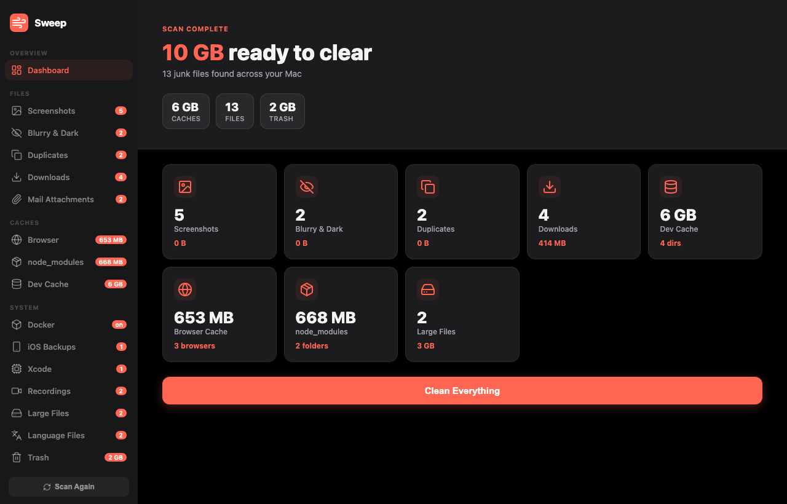

# Sweep

A free, open-source Mac cleaner that finds and removes junk files — screenshots, blurry photos, duplicate images, old downloads, dev caches, node_modules, iOS backups, and more.

No subscription. No upsell. Just a fast, native macOS app that lives in your menu bar.



---

## Features

- **Screenshots** — finds old screenshots cluttering your Desktop
- **Blurry & Dark Photos** — AI detection of bad photos in your Photos library
- **Duplicate Photos** — perceptual hash comparison to find identical images
- **Downloads** — lists old files in your Downloads folder
- **Dev Caches** — npm, pip, uv, Yarn, Gradle, Xcode DerivedData, and more
- **Browser Caches** — Chrome, Safari, Arc, Firefox, Brave, Edge
- **node_modules** — finds stale node_modules folders across your projects
- **iOS Backups** — old iPhone/iPad backups stored on your Mac
- **Xcode Archives** — old .xcarchive build artifacts
- **Recordings** — Zoom, Teams, and screen recordings
- **Language Files** — removes unused language packs from installed apps
- **Mail Attachments** — old attachments from Apple Mail
- **Docker** — prunes unused images, containers, and volumes
- **Large Files** — anything over 500 MB hiding in your home folder

---

## Download

**[⬇️ Download Sweep for Mac](https://github.com/Gobienvi/sweep/releases/latest)**

Requires macOS 13 or later (Apple Silicon + Intel).

> **First launch:** Right-click → Open → Open anyway (macOS Gatekeeper warning for unsigned apps)

---

## Install from source

```bash
git clone https://github.com/Gobienvi/sweep.git
cd sweep
python3 -m venv venv
source venv/bin/activate
pip install -r requirements.txt
python main.py
```

### Build the .app

```bash
bash build.sh
# Output: dist/Sweep.app and dist/Sweep-1.0.0.dmg
```

---

## How it works

Sweep runs as a lightweight menu bar app. Click **Scan Only** to open the dashboard — it scans your Mac and shows everything it found, organised by category. You review what to delete, check or uncheck individual files, and click **Clean Everything** (or clean section by section).

Files are moved to **Trash**, not permanently deleted — so you can always recover them.

---

## Stack

- Python 3 + [rumps](https://github.com/jaredks/rumps) (menu bar)
- PyObjC + WKWebView (native macOS window)
- Pillow + imagehash + scipy (photo analysis)
- PyInstaller (packaging)

---

## License

MIT — free to use, modify, and distribute.
